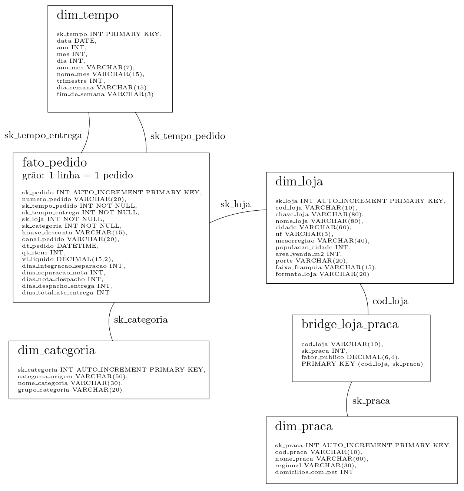

# Modelagem - Pata Amiga 🐾

Este reposítorio trata do 1º projeto avaliativo do 2º módulo do curso de análise de dados do SCTEC.
Consiste no tratamento, modelagem e análise dos dados referentes à uma rede de lojas no ramo de pets.
Inicialmente são investigados os problemas encontrados nos dados originais, para posterior tratamento e modelagem dos mesmos.
Por fim, questões pertinentes ao negócio são respondidas.

### Problemas no conjunto inicial de dados

Alguns problemas de dados incompletos e grafias alternativas ou erradas foram encontrados.
Portanto, faz-se uma análise preliminar para realizar a identificação quantitativa dos mesmos por meio de consultas em SQL ao conjunto de dados no banco.
Destes problemas, vale destacar:

- Quantas grafias de loja existem?

    49

    consulta SQL:
    ```SQL
    select distinct(`Loja-Nome`) from stg_pedido;
    ```
- Quantas grafias de categoria?

    18

    consulta SQL:
    ```SQL
    select distinct(CategoriaProduto) from stg_pedido;
    ```
- Quantos pedidos vieram sem código de loja?

    1575

    consulta SQL:
    ```SQL
    select count(*) from stg_pedido where `Cod Loja` = '';
    ```
- Quantos pedidos vieram sem nome de loja?

    3

    consulta SQL:
    ```SQL
    select count(*) from stg_pedido where `Loja-Nome` = '';
    ```

- Quantos marcos de processo estão em branco?

    |   separacao_estoque |   nota_fiscal |   despacho_transporte |   entrega_cliente |   total |
    |---------------------|---------------|-----------------------|-------------------|---------|
    |                1077 |          1338 |                  1665 |              1953 |    6033 |

    consulta SQL:
    ```SQL
    select
        a.r as separacao_estoque, 
        b.r as nota_fiscal,
        c.r as despacho_transporte,
        d.r as entrega_cliente,
        e.r as total
    from (select count(*) as r from stg_pedido where `Dt Separacao Estoque` = '') a
    join (select count(*) as r from stg_pedido where DtNotaFiscal = '') b
    join (select count(*) as r from stg_pedido where Dt_Despacho_Transportadora = '') c
    join (select count(*) as r from stg_pedido where DtEntregaCliente = '') d
    join (select count(*) as r from (
        select * from stg_pedido where `Dt Separacao Estoque` = ''
        union all
        select * from stg_pedido where DtNotaFiscal = ''
        union all
        select * from stg_pedido where Dt_Despacho_Transportadora = ''
        union all
        select * from stg_pedido where DtEntregaCliente = ''
    ) f) e;
    ```

### Ordem de execução dos arquivos '.sql'

A construção do banco, carregamento, modelagem e transformação dos dados é feita por meio da execução sequencial dos arquivos '.sql' encontrados na pasta './sql/'.
A correta execução dos mesmos no ambiente do 'MySQL Workbench' segue a ordem numérica:

1. 01-carga-staging.sql
2. 02-dimensoes-prontas.sql
3. 03-dimensoes.sql
4. 04-fato.sql
5. 05-perguntas.sql

### Staging e carga

A construção das tabelas e carga dos dados originais é feita pela execução do arquivo '01-carga-staging.sql'.
Desta forma tem-se a presença das seguintes tabelas no banco de dados:

- stg_pedido
- stg_loja
- stg_loja_praca

### Dimensões da modelagem e transformação

A modelagem do dataset é realizada por meio da tabela fato dos pedidos ('fato_pedido'), ligada por meio de chaves substitutas ('surrogate keys') à dimensões relevantes.
Para o projeto em questão, as dimensões de importância são as de tempo ('dim_tempo'), categoria ('dim_categoria'), loja ('dim_loja') e praça ('dim_praca').
Para representar a relação N:N entre as lojas e praça, ligam-se estas dimensões por meio de uma tabela ponte ('bridge_loja_praca').
No conjunto, tem-se a tabela fato no centro, conectada às dimensões tempo, categoria e loja.
Já a dimensão praça está conectada exclusivamente à dimensão loja por meio da tabela ponte 'bridge_loja_praca'.

A construção de parte das dimensões já consolidada da modelagem e respectiva carga é feita pelo arquivo '02-dimensoes-prontas.sql'.
Tais dimensões são as 'dim_tempo' e 'dim_loja'.

Já no arquivo '03-dimensoes.sql' está a parte responsável pela definição, transformação dos dados e carga das dimensões 'dim_categoria', 'dim_praca', 'bridge_loja_praca' e 'fato_pedido'.
Representa-se à seguir o código responsável pela carga das respectivas dimensões:

**dim_categoria**:
```SQL
delete from dim_categoria;
insert into dim_categoria values
(-1, '', 'Nao informado', 'Nao informado');
alter table dim_categoria auto_increment = 1;
insert into dim_categoria (categoria_origem, nome_categoria, grupo_categoria)
select
    a.cat,
    case
        when upper(a.cat) like '%MED%' then 'Medicamento'
        when upper(a.cat) like '%PETISC%' then 'Petisco'
        when upper(a.cat) like '%RA%' then 'Racao'
        when upper(a.cat) like '%HIG%' then 'Higiene'
        when upper(a.cat) like '%BRINQ%' then 'Brinquedo'
        when upper(a.cat) like '%ACESS%' then 'Acessorio'
        when upper(a.cat) like '%SERV%' then 'Servico'
    end,
     case
        when upper(a.cat) like '%MED%' then 'Saude e Higiene'
        when upper(a.cat) like '%PETISC%' then 'Alimentacao'
        when upper(a.cat) like '%RA%' then 'Alimentacao'
        when upper(a.cat) like '%HIG%' then 'Saude e Higiene'
        when upper(a.cat) like '%BRINQ%' then 'Bem-estar'
        when upper(a.cat) like '%ACESS%' then 'Bem-estar'
        when upper(a.cat) like '%SERV%' then 'Bem-estar'
    end
from (
    select
        distinct(CategoriaProduto) as cat
    from stg_pedido
) a;
```

**dim_praca**:
```SQL
delete from dim_praca;
insert into dim_praca values
(-1, '', 'Nao informado', 'Nao informado', 0);
alter table dim_praca auto_increment = 1;
insert into dim_praca (cod_praca, nome_praca, regional, domicilios_com_pet)
select
    CodPraca,
    NomePraca,
    Regional,
    cast(replace(DomiciliosComPet, '.', '') as signed)
from (
    select
        distinct(CodPraca),
        NomePraca,
        Regional,
        DomiciliosComPet
    from stg_loja_praca
) a;
```

**bridge_loja_praca**:
```SQL
delete from bridge_loja_praca;
insert into bridge_loja_praca
select
    CodLoja,
    sk_praca,
    cast(PercentualPublico as decimal(10,2))
from (
    select
        s.CodLoja,
        d.sk_praca,
        s.PercentualPublico
    from stg_loja_praca s
    left join dim_praca d
    on s.NomePraca = d.nome_praca
) a;
```

**fato_pedido**:
```SQL
delete from fato_pedido;
alter table fato_pedido auto_increment = 1;
insert into fato_pedido (
	`numero_pedido`,
	`sk_tempo_pedido`,
	`sk_tempo_entrega`,
	`sk_loja`,
	`sk_categoria`,
	`houve_desconto`,
	`canal_pedido`,
	`dt_pedido`,
	`qt_itens`,
	`vl_liquido`,
	`dias_integracao_separacao`,
	`dias_separacao_nota`,
	`dias_nota_despacho`,
	`dias_despacho_entrega`,
	`dias_total_ate_entrega`
)
select
    p.NumeroPedido as numero_pedido,
    cast(date_format(str_to_date(p.DtHoraPedido, '%m/%d/%Y %h:%i %p'), '%Y%m%d') as signed) as sk_tempo_pedido,
    if(p.DtEntregaCliente = '', -1, cast(date_format(date(p.DtEntregaCliente), '%Y%m%d') as signed)) as sk_tempo_entrega,
    dl.sk_loja,
    dc.sk_categoria,
    case
        when upper(trim(p.HouveDesconto)) in ('S', 'SIM', '1', 'X', 'TRUE', 'V') then 'Sim'
        when upper(trim(p.HouveDesconto)) in ('N', 'NAO', '0', 'FALSE', 'F') then 'Nao'
        else 'Nao Informado'
    end as houve_desconto,
    case
        when upper(trim(p.CanalPedido)) like '%WHATS%' then 'WhatsApp'
        when upper(trim(p.CanalPedido)) like '%APP%' then 'App'
        when upper(trim(p.CanalPedido)) like '%SITE%' then 'Site'
        when upper(trim(p.CanalPedido)) like '%LOJA%' then 'Loja Fisica'
        when upper(trim(p.CanalPedido)) like '%TEL%' then 'Telefone'
        else 'Nao Informado'
    end as canal_pedido,
    str_to_date(p.DtHoraPedido, '%m/%d/%Y %h:%i %p') as dt_pedido,
    cast(nullif(nullif(p.`QTD.Itens`, '-'), '') as signed) as qt_itens,
    case
        when trim(replace(p.`ValorLiquidoPedido(R$)`,'R$','')) in ('','-') then null
        when p.`ValorLiquidoPedido(R$)` like '%,%' then cast(replace(replace(replace(replace(p.`ValorLiquidoPedido(R$)`,'R$',''),' ',''),'.',''),',','.') as decimal(15,2))
        else cast(replace(replace(p.`ValorLiquidoPedido(R$)`,'R$',''),' ','') as decimal(15,2))
    end as vl_liquido,
    datediff(if(p.`Dt Separacao Estoque` = '', null, date(p.`Dt Separacao Estoque`)), str_to_date(p.DtHoraIntegracaoERP, '%m/%d/%Y %h:%i %p')) as dias_integracao_separacao,
    datediff(if(p.DtNotaFiscal = '', null, date(p.DtNotaFiscal)), if(p.`Dt Separacao Estoque` = '', null, date(p.`Dt Separacao Estoque`))) as dias_separacao_nota,
    datediff(if(p.Dt_Despacho_Transportadora = '', null, date(p.Dt_Despacho_Transportadora)), if(p.DtNotaFiscal = '', null, date(p.DtNotaFiscal))) as dias_nota_despacho,
    datediff(if(p.DtEntregaCliente = '', null, date(p.DtEntregaCliente)), if(p.Dt_Despacho_Transportadora = '', null, date(p.Dt_Despacho_Transportadora))) as dias_despacho_entrega,
    datediff(if(p.DtEntregaCliente = '', null, date(p.DtEntregaCliente)), str_to_date(p.DtHoraPedido, '%m/%d/%Y %h:%i %p')) as dias_total_ate_entrega
from stg_pedido p
left join dim_loja dl
on
    case
        when upper(p.`Loja-Nome`) like '%BLUMENAL%' then replace(trim(replace(replace(upper(p.`Loja-Nome`), '/SC', ''), '  ', ' ')), 'BLUMENAL', 'BLUMENAU')
        when upper(p.`Loja-Nome`) like '%FLORIPA%' then replace(trim(replace(replace(upper(p.`Loja-Nome`), '/SC', ''), '  ', ' ')), 'FLORIPA', 'FLORIANOPOLIS')
        when upper(p.`Loja-Nome`) like '%JGUA%' then replace(trim(replace(replace(upper(p.`Loja-Nome`), '/SC', ''), '  ', ' ')), 'JGUA', 'JARAGUA')
        when p.`Loja-Nome` = '' then 'NAO INFORMADO'
        else trim(replace(replace(upper(p.`Loja-Nome`), '/SC', ''), '  ', ' '))
    end = dl.chave_loja
left join dim_categoria dc
on dc.categoria_origem = p.`CategoriaProduto`;
```

### Diagrama

À seguir é mostrado o diagrama do modelo construído:

<figure class="image">
    
    <figcaption style="text-align: center; font-size: 0.8rem; font-weight: bold"><br>Diagrama do modelo para o banco de dados</figcaption>
</figure>

### Perguntas de negócio

Adicionalmente, tem-se algumas perguntas de negócio que precisam ser respondidas.
À seguir são apresentadas cada uma das respostas com o respectivo código 'SQL' utilizado:

##### P1. Onde está o gargalo da entrega?

Na tabela seguinte são apresentados os tempos médios, em dias, entre cada uma das etapas do processo de entrega dos pedidos, para cada uma das categorias de porte de loja.
Também é mostrado o tempo médio global de entrega para toda a rede.

| porte         |   integracao_separacao |   separacao_nota |   nota_despacho |   despacho_entrega |   total_ate_entrega |   total_ate_entrega_da_rede |
|---------------|------------------------|------------------|-----------------|--------------------|---------------------|-----------------------------|
| Pequena       |                 3.0201 |           0.6946 |          8.5337 |             2.8627 |             15.2712 |                      9.1076 |
| Media         |                 1.9813 |           0.624  |          3.3407 |             2.0261 |              8.0625 |                      9.1076 |
| Grande        |                 1.9597 |           0.6419 |          3.3167 |             2.01   |              8.0388 |                      9.1076 |
| Nao Informado |                 2      |           0      |          4      |             3      |              8.5    |                      9.1076 |

Percebe-se que o gargalo se encontra na etapa entre a emissão da nota e o despacho, indempendentemente do porte da loja.
Ademais, para lojas de porte pequeno o tempo médio, para qualquer etapa do processo, é significativamente maior em comparação com os tempos das lojas de porte médio e grande.

O código SQL:
```SQL
select
    dl.porte,
    avg(dias_integracao_separacao) as integracao_separacao,
    avg(dias_separacao_nota) as separacao_nota,
    avg(dias_nota_despacho) as nota_despacho,
    avg(dias_despacho_entrega) as despacho_entrega,
    avg(dias_total_ate_entrega) as total_ate_entrega,
    (select avg(dias_total_ate_entrega) from fato_pedido) as total_ate_entrega_da_rede
from fato_pedido p
join dim_loja dl
on p.sk_loja = dl.sk_loja
group by dl.porte;
```

##### P2. Qual categoria concentra o faturamento?

Na tabela à seguir são mostrados o faturamento e o faturamento relativo em percentual para cada uma das categorias, agregadas por porte de loja.

| porte         | nome_categoria   |   faturamento |   total_perc |
|---------------|------------------|---------------|--------------|
| Pequena       | Racao            |        164198 |         0.6  |
| Pequena       | Medicamento      |         41350 |         0.15 |
| Pequena       | Petisco          |         21291 |         0.08 |
| Pequena       | Higiene          |         18166 |         0.07 |
| Pequena       | Servico          |         15174 |         0.06 |
| Pequena       | Acessorio        |         10247 |         0.04 |
| Pequena       | Brinquedo        |          3620 |         0.01 |
| Nao Informado | Racao            |           687 |         0.7  |
| Nao Informado | Higiene          |           178 |         0.18 |
| Nao Informado | Petisco          |           122 |         0.12 |
| Media         | Racao            |        443132 |         0.6  |
| Media         | Medicamento      |        128625 |         0.17 |
| Media         | Petisco          |         51173 |         0.07 |
| Media         | Higiene          |         34717 |         0.05 |
| Media         | Servico          |         37052 |         0.05 |
| Media         | Acessorio        |         27991 |         0.04 |
| Media         | Brinquedo        |         14192 |         0.02 |
| Grande        | Racao            |        468187 |         0.6  |
| Grande        | Medicamento      |        135929 |         0.17 |
| Grande        | Petisco          |         56004 |         0.07 |
| Grande        | Servico          |         41776 |         0.05 |
| Grande        | Higiene          |         39253 |         0.05 |
| Grande        | Acessorio        |         26424 |         0.03 |
| Grande        | Brinquedo        |         13822 |         0.02 |

Percebe-se que, para as 3 categorias de porte de loja (Pequena, Média e Grande), a categoria campeã de faturamento (Ração) se mantém.

Código SQL:
```SQL
select
    dl.porte,
    dc.nome_categoria,
    round(sum(p.vl_liquido)) as faturamento,
    round(sum(p.vl_liquido) / (select sum(fp.vl_liquido) from fato_pedido fp join dim_loja dl2 on fp.sk_loja = dl2.sk_loja where dl.porte = dl2.porte), 2) as total_perc
from
	fato_pedido p
join dim_categoria dc
on p.sk_categoria = dc.sk_categoria
join dim_loja dl
on p.sk_loja = dl.sk_loja
group by dl.porte, dc.nome_categoria
order by porte desc, total_perc desc;
```

##### P3. O desconto funciona igual em todo canal?

A próxima tabela mostra o valor to ticket médio e faturamento relativo por canal de pedido, para os casos em que houve ou não desconto.

| houve_desconto   | canal_pedido   |   ticket_medio |   faturamento_perc |
|------------------|----------------|----------------|--------------------|
| Sim              | Nao Informado  |         561.59 |               0.06 |
| Sim              | WhatsApp       |         514.33 |               0.1  |
| Sim              | Telefone       |         514.02 |               0.06 |
| Sim              | Site           |         501.92 |               0.22 |
| Sim              | Loja Fisica    |         494.04 |               0.18 |
| Sim              | App            |         488.04 |               0.28 |
| Nao Informado    | Telefone       |         522.31 |               0    |
| Nao Informado    | App            |         505.68 |               0.02 |
| Nao Informado    | Nao Informado  |         463.31 |               0    |
| Nao Informado    | WhatsApp       |         447.8  |               0    |
| Nao Informado    | Site           |         428.13 |               0.01 |
| Nao Informado    | Loja Fisica    |         347.75 |               0.01 |
| Nao              | Nao Informado  |         206.95 |               0    |
| Nao              | Loja Fisica    |         197.55 |               0.01 |
| Nao              | Telefone       |         195.23 |               0    |
| Nao              | Site           |         189.68 |               0.02 |
| Nao              | WhatsApp       |         179.26 |               0.01 |
| Nao              | App            |         167.63 |               0.01 |

Percebe-se que o valor de ticket médio da categorias com desconto registraram valores significativamente superiores às mesmas categorias sem o desconto.
Ademais, para o caso em que houve desconto, a maior diferença percentual de ticket médio entre as categorias é de 5,39% (desconsiderando a categoria 'Não informado').
Já a diferença entre o ticket médio da categoria 'Não informado' e 'WhatsApp' (segunda maior) é de 9,18%.
Este valor de diferença não aparece para o caso das categorias em que não houve desconto.
Por fim, percebe-se que 90% do faturamento provém dos canais em que foi aplicado desconto.

Código SQL:
```SQL
select
    p.houve_desconto,
    p.canal_pedido,
    round(avg(p.vl_liquido), 2) as ticket_medio,
    round(sum(p.vl_liquido) / (select sum(vl_liquido) from fato_pedido), 2) as faturamento_perc
from fato_pedido p
group by p.canal_pedido, p.houve_desconto
order by p.houve_desconto desc, avg(p.vl_liquido) desc;
```

##### P4. Qual praça de atendimento concentra o faturamento?

Na sequência, a próxima tabela mostra o faturamento em cada uma das praças, junto com os valores de domicílios com pet.

| nome_praca           |   vl_total |   domicilios_com_pet |
|----------------------|------------|----------------------|
| Vale do Itajai       |   633746   |               148000 |
| Grande Florianopolis |   283547   |               132000 |
| Norte Industrial     |   175432   |                96000 |
| Litoral Sul          |   137051   |                58000 |
| Litoral Norte        |   128873   |                61000 |
| Extremo Oeste        |    98359.2 |                63000 |
| Carbonifera          |    88707.4 |                67000 |
| Serra Catarinense    |    80477.6 |                44000 |
| Meio-Oeste           |    58955.6 |                51000 |
| Foz do Itajai        |    46749.7 |                74000 |
| Planalto Norte       |    31100.8 |                33000 |
| Planalto Serrano     |    29323.1 |                29000 |

Nota-se que grande parte do faturamento provém das praças 'Vale do Itajaí' e 'Grande Florianópolis', que também concentram o maior número de domicílios com animais de estimação.

Código SQL:
```SQL
select
    dp.nome_praca,
    round(sum(p.vl_liquido * b.fator_publico), 2) as vl_total,
    dp.domicilios_com_pet
from
	fato_pedido p
join dim_loja dl
on p.sk_loja = dl.sk_loja
join bridge_loja_praca b
on b.cod_loja = dl.cod_loja
join dim_praca dp
on b.sk_praca = dp.sk_praca
group by dp.nome_praca, dp.domicilios_com_pet
order by vl_total desc;
```

##### P5. Onde abrir a próxima loja, e o que os dados não permitem afirmar?

*P5a: Rankeamento de lojas por itens vendidos por mil habitantes:*

A tabela a seguir mostra as lojas ranqueadas pela quantidade itens por mil habitantes, junto com o seu tempo médio de entrega do pedido.

| nome_loja                            |   qtd_itens |   populacao |   qtd_itens_por_mil |   tempo_entrega_medio |
|--------------------------------------|-------------|-------------|---------------------|-----------------------|
| Pata Amiga Rio dos Cedros            |         474 |       11322 |               41.87 |               14.3103 |
| Pata Amiga Presidente Getulio        |         570 |       16359 |               34.84 |               14.2558 |
| Pata Amiga Ibirama                   |         597 |       18613 |               32.07 |               15.5    |
| Pata Amiga Itapoa                    |         534 |       20586 |               25.94 |               15.5278 |
| Pata Amiga Santo Amaro da Imperatriz |         530 |       22357 |               23.71 |               16      |
| Pata Amiga Taio                      |         352 |       18173 |               19.37 |               14.6333 |
| Pata Amiga Timbo                     |         804 |       45011 |               17.86 |                7.7667 |
| Pata Amiga Gaspar                    |        1189 |       71133 |               16.72 |                8.1042 |
| Pata Amiga Otacilio Costa            |         289 |       18227 |               15.86 |               15.7222 |
| Pata Amiga Ituporanga                |         354 |       25748 |               13.75 |               16.6316 |
| Pata Amiga Rio do Sul                |         885 |       73135 |               12.1  |                8.4651 |
| Pata Amiga Sao Joaquim               |         320 |       27234 |               11.75 |               15.2222 |
| Pata Amiga Laguna                    |         541 |       46122 |               11.73 |                8.6889 |
| Pata Amiga Indaial                   |         750 |       71987 |               10.42 |                7.8462 |
| Pata Amiga Ararangua                 |         689 |       68274 |               10.09 |                8.2941 |
| Pata Amiga Tubarao                   |         889 |      105511 |                8.43 |                7.8072 |
| Pata Amiga Jaragua do Sul            |        1507 |      184579 |                8.16 |                8.1583 |
| Pata Amiga Curitibanos               |         308 |       39061 |                7.89 |                8.8    |
| Pata Amiga Sao Bento do Sul          |         567 |       87310 |                6.49 |                8.2727 |
| Pata Amiga Concordia                 |         470 |       74641 |                6.3  |                7.8205 |
| Pata Amiga Blumenau Centro           |        2002 |      361855 |                5.53 |                7.8701 |
| Pata Amiga Xanxere                   |         284 |       52034 |                5.46 |                8.2414 |
| Pata Amiga Palhoca                   |         844 |      168259 |                5.02 |                7.8471 |
| Pata Amiga Sao Miguel do Oeste       |         186 |       41520 |                4.48 |                8.12   |
| Pata Amiga Brusque                   |         558 |      143270 |                3.89 |                7.746  |
| Pata Amiga Criciuma                  |         822 |      217392 |                3.78 |                8.1711 |
| Pata Amiga Lages                     |         593 |      158846 |                3.73 |                7.8197 |
| Pata Amiga Sao Jose Kobrasol         |         929 |      250181 |                3.71 |                8.12   |
| Pata Amiga Chapeco                   |         824 |      254235 |                3.24 |                7.9756 |
| Pata Amiga Joinville Sul             |        1888 |      597658 |                3.16 |                7.9103 |
| Pata Amiga Itajai Praia              |         798 |      264054 |                3.02 |                8.1458 |
| Pata Amiga Florianopolis Norte       |        1426 |      537213 |                2.65 |                8.1111 |
| Nao Informado                        |          20 |         nan |              nan    |                8.5    |

Pode-se perceber que, de forma geral, há uma correlação positiva entre os tempos de entrega médio e a quantidade relativa de itens vendidos.

Código SQL:
```SQL
select
    dl.nome_loja,
    sum(p.qt_itens) as qtd_itens,
    dl.populacao_cidade as populacao,
    round(1000 * sum(p.qt_itens) / dl.populacao_cidade, 2) as qtd_itens_por_mil,
    avg(p.dias_total_ate_entrega) as tempo_entrega_medio
from
	fato_pedido p
join dim_loja dl
on p.sk_loja = dl.sk_loja
group by dl.nome_loja, dl.populacao_cidade
order by proporcao desc;
```

*P5b: O faturamento por faixa atual:*

A tabela seguinte mostra o faturamento total e relativo por faixa de franquia das lojas na rede.

| faixa_franquia   |      faturamento |   percentual |
|------------------|------------------|--------------|
| Ouro             | 1011264.4        |     0.56391  |
| Diamante         |  382210          |     0.213131 |
| Prata            |  314812          |     0.175548 |
| Bronze           |   84036.1        |     0.046861 |
| Nao Informado    |     986.3        |     0.00055  |

É possível perceber que as faixas 'Ouro' e 'Diamante' concentram quase 80% do faturamento total.
Vale ressaltar que estes valores não nos dizem o quanto veio das lojas que já eram 'Ouro' na data do pedido, já que o cadastro só reflete a informação atual.
Ou seja, o passado é sobrescrito com a atualização dos dados.

Código SQL:
```SQL
select
    dl.faixa_franquia,
    sum(p.vl_liquido) as faturamento,
    sum(p.vl_liquido) / (select round(sum(vl_liquido), 2) from fato_pedido) as percentual
from fato_pedido p
join dim_loja dl
on p.sk_loja = dl.sk_loja
group by dl.faixa_franquia
order by faturamento desc;
```

*P5c: Medidas dos pedidos que "ficaram de fora":*

Na próxima tabela são mostradas as métricas para os pedidos incompletos, sejam por não possuírem loja cadastrada, não foram entregues, não possuem itens ou valores registrados.

|   sem_loja |   nao_entregados |   sem_itens |   sem_valores |
|------------|------------------|-------------|---------------|
|          3 |             1953 |         257 |           121 |

De forma geral, estes valores compõem um dashboard de métricas indesejadas. Das quais se deve trabalhar para a sua eliminação ou minimização.

Código SQL:
```SQL
select
    a.r as sem_loja, 
    b.r as nao_entregados,
    c.r as sem_itens,
    d.r as sem_valores
from (select count(*) as r from fato_pedido where sk_loja = -1) a
join (select count(*) as r from fato_pedido where sk_tempo_entrega = -1) b
join (select count(*) as r from fato_pedido where qt_itens is null) c
join (select count(*) as r from fato_pedido where vl_liquido is null) d;
```

### Conclusão

O dataset inicial continha erros, grafias alternativas para um mesmo dado, inconsistências e entradas incompletas.
Por meio de uma estratégia de organização, limpeza, tratamento e modelagem, foi possível construir uma pipeline capaz que resolver esses problemas e permitir a correta análise das informações contidas ali.
Adicionalmente a correta modelagem da informação nos permite extrair e obter insights mais profundos e valiosos sobre o dataset, que de outra maneira não seria de forma tão prática ou possível.

Considerando a faixa de valores de quantidade de itens vendidos por mil habitantes para as diversas lojas, pode-se crer que muitas das regiões cujos valores se mostraram pequenos ainda possuem bastante potencial para a venda de mais produtos.
Neste sentido uma possível sugestão seria a amplicação ou abertura de mais lojas nestes locais (por ex. no Vale do Itajaí ou na Grande Florianópolis), se valendo do fato que estes locais ainda não estão tão saturados quanto outras lojas com valores bem superiores de itens vendidos por mil habitantes.

Ainda, há informações e questões que não podem ser respondidas exclusivamente por meio do dataset analisado.
Dentre elas, a saturação e real potencial de crescimento do segmento de pets em cada região, já que também não temos as informações das empresas concorrentes, impossibilitando de se realizar uma análise de mais abrangente.
Outro comportamento observado é a correlação positiva entre a quantidade de itens vendidos e o tempo de entrega médio para as lojas analisadas.
Percebe-se que quanto maior for um valor, maior será o outro, mas isso não significa necessariamente um vínculo de causalidade.
Necessita-se, portanto, de uma análise mais criteriosa com mais detalhes e informações sobre o porque deste comportamento.
Possíveis causas podem incluir infraestrutura precária, contingente de funcionários escasso, alguma questão no atual fluxo de trabalho da rede que precisa ser melhorada, dentre outros.

Por fim, os dados presentes compõem um cenário atual da rede de lojas, não contemplando o histórico e suas respectivas mudanças.
Logo, também não é possível extrair conclusões e insights que dependam da dimensão temporal, já que os dados são continuadamente sobrescritos com a atualização dos mesmos.
